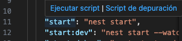
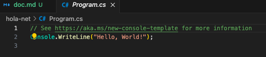

## Hello World Nest-Django-Net

**Nest**

Pasos para hacer un hola mundo en NestJS


Primero, asegúrate de tener Node.js y npm instalados en tu sistema. Luego, instala la CLI de NestJS globalmente utilizando npm en la terminal:

```
npm install -g @nestjs/cli
```

Una vez instalada la CLI de NestJS, puedes crear un nuevo proyecto ejecutando el siguiente comando en la terminal:

```
nest new name-project
```
Una vez creado abrimos el proyecto en **_visual studio code_**, nos dirijimos a la parte de -package.json-, y arrancamos el proyecto en la parte de start.



En nuestro navegador preferido ponemos http://localhost:3000/ y nos aparece nuestro HOLA MUNDO.


**Django**


Primero, asegúrate de tener Python instalado en tu sistema. Luego, puedes instalar Django usando pip, el gestor de paquetes de Python, en caso de MAC utilizar pip3:

```
pip install django
```

Para crear un nuevo proyecto Django, ejecuta el siguiente comando en la terminal:

```
django-admin startproject name-project
```

Accedemos  al directorio del proyecto recién creado con cd.

En Django, las aplicaciones son componentes reutilizables que realizan tareas específicas. Puedes crear una aplicación dentro del proyecto ejecutando:

```
python manage.py startapp firsthello
```
Esto creará un directorio hello dentro de tu proyecto para la aplicación.

Abre el archivo firsthello/views.py  en VSC que se creó en el paso anterior y define una función de vista que retornará "¡Hola Mundo!":

```python
from django.http import HttpResponse

def hello_world(request):
    return HttpResponse("¡Hola Mundo!")
```

Abre el archivo name-project/urls.py en el directorio principal del proyecto y configura una URL para la vista hello_world que creaste:

```python
from django.urls import path
from firsthello import views

urlpatterns = [
    path('hello/', views.hello_world, name='hello_world'),
]
```

Ahora, puedes ejecutar el servidor de desarrollo de Django usando el siguiente comando en la terminal:

```
python manage.py runserver
```

Abre tu navegador web y navega a http://localhost:8000/firsthello/. Deberías ver el mensaje "¡Hola Mundo!" en la página.


**Net**


Primero, asegúrate de tener el SDK de .NET instalado en tu sistema. Puedes descargarlo desde dotnet.microsoft.com e instalarlo siguiendo las instrucciones proporcionadas.

Abre tu terminal o línea de comandos y ejecuta el siguiente comando para crear un nuevo proyecto de consola en C#:

```
dotnet new console -n HolaMundoDotNet
```

Esto creará un nuevo directorio llamado HolaMundoDotNet con una aplicación de consola básica.

Despues abrimos este proyecto en VSC y abrimos el archivo `Program.cs`

Y veremos el hola mundo:



Desde la terminal, dentro del directorio HolaMundoDotNet, ejecuta el siguiente comando para compilar y ejecutar la aplicación:

```
dotnet run
```

Después de ejecutar dotnet run, deberías ver la frase "¡Hola Mundo!" impresa en la consola de tu terminal.